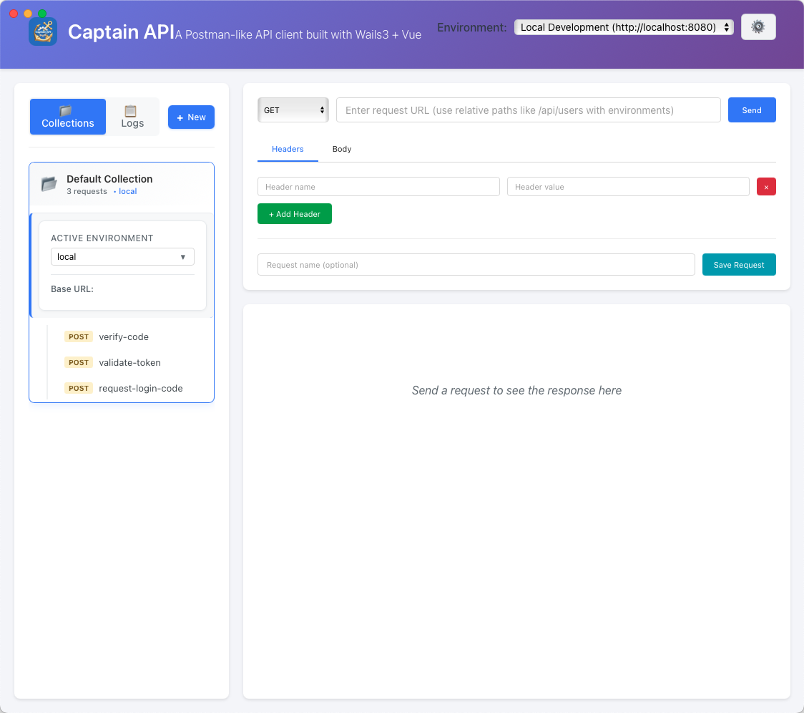

# Captain API - Postman-like Client

Captain API is a modern, desktop-based API testing client built with cutting-edge technologies (Go + Vue3 + Wails3) that provides developers with a powerful, Postman-like interface for testing and managing HTTP APIs.

## What is Captain API?
Captain API is a free, open-source API testing tool designed to streamline the API development and testing workflow. Whether you're a backend developer, frontend engineer, or QA tester, Captain API provides an intuitive interface to send HTTP requests, organize API collections, and analyze responses efficiently.

## Why Choose Captain API?
✅ Free & Open Source - No subscription fees or usage limits  
✅ Privacy-First - All data stored locally on your machine  
✅ Fast & Lightweight - Native desktop performance   
✅ Cross-Platform - Works on Windows, macOS, and Linux 

*Captain API empowers developers to test, debug, and document APIs efficiently with a tool that prioritizes simplicity, performance, and developer experience.*

## Screenshots


*Modern API testing interface with request builder and response viewer*

## Features

### 🚀 Core Features
- **HTTP Request Builder**: Support for GET, POST, PUT, DELETE, PATCH, HEAD, OPTIONS methods
- **Request Management**: Save, organize, and reuse requests in collections
- **Response Viewer**: Beautiful response display with syntax highlighting
- **Headers Management**: Easy-to-use interface for managing request headers
- **Body Support**: JSON, text, and raw body types
- **Collections**: Organize requests into collections for better management
- **Persistent Storage**: Requests are saved locally for future use

### 🎨 UI Features
- **Modern Interface**: Clean, responsive design inspired by Postman
- **Tabbed Interface**: Separate tabs for headers, body, and response
- **Real-time Response**: Live response display with status codes, timing, and size
- **JSON Formatting**: Automatic JSON formatting and validation
- **Copy to Clipboard**: Easy copying of response data

## Getting Started

### Prerequisites
- Go 1.22+ 
- Node.js 18+
- Bun (package manager)
- Wails v3

### Installation

1. **Install Wails3** (if not already installed):
   ```bash
   go install github.com/wailsapp/wails/v3/cmd/wails3@latest
   ```

2. **Clone the repository** (if not already done):
   ```bash
   git clone https://github.com/JessonChan/captain-api
   cd captain-api
   ```

3. **Install dependencies and build**:
   ```bash
   # This will automatically install frontend dependencies, 
   # generate bindings, and build the application
   wails3 build
   ```

   Or for development with auto-reload:
   ```bash
   wails3 dev
   ```

### Development

To run the application in development mode with hot reload:

```bash
wails3 dev
```

This will start the application with:
- Hot reload for frontend changes
- Automatic Go code recompilation
- Debug console access

### Production Build

To create a production build:

```bash
wails3 build
```

The built application will be available in the `build/bin/` directory.

### Generate Bindings

If you modify Go services and need to regenerate frontend bindings:

```bash
wails3 generate bindings
```

This provides:
- Browser developer tools access
- Console logging
- Hot reload for faster development

## Contributing

1. Fork the repository
2. Create a feature branch
3. Make your changes
4. Test thoroughly
5. Submit a pull request

## License

This project is licensed under the MIT License - see the LICENSE file for details.

## Acknowledgments

- Built with [Wails](https://wails.io/) - Go + Web frontend framework
- Inspired by [Postman](https://www.postman.com/)
- Icons and styling inspired by modern API tools

---

**Happy API Testing! 🚀**
